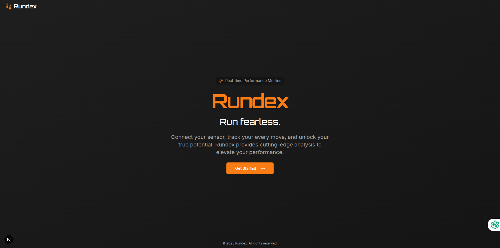
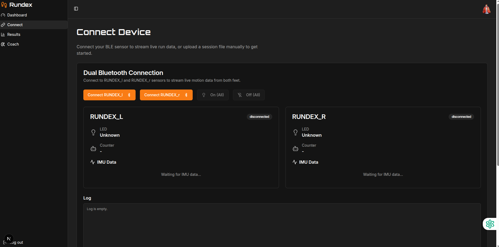
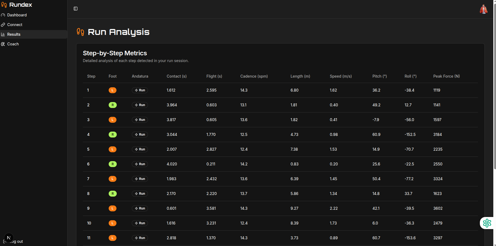
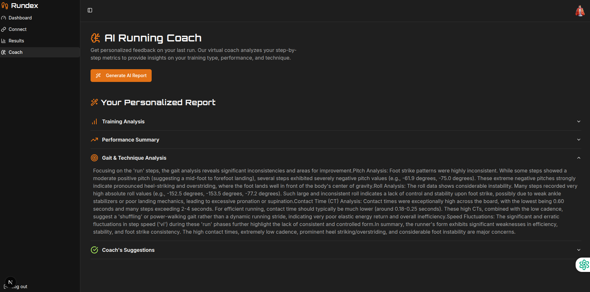

# Rundex 🏃‍♂️

> **Run Fearless.** The advanced biomechanical running tracker powered by Dual-Bluetooth technology and Generative AI.

<p align="center">
  
  
  
  

## 📖 Project Overview

**Rundex** is a mobile application designed to democratize professional-grade athletic analysis. Unlike standard fitness trackers that only measure distance or heart rate, Rundex focuses on **biomechanics**.

By connecting simultaneously to two independent wearable sensors (IMUs) placed on the user's feet, the application captures high-fidelity motion data in real-time. This "stereoscopic" approach allows for precise detection of asymmetries, impact forces, and stride efficiency.

The ecosystem is completed by an **AI Virtual Coach**, which processes the raw telemetry to generate natural language reports, technical feedback, and injury prevention strategies.

## Key Features

* **Frictionless Onboarding**
    * Secure and instant authentication via **Google Sign-In**.
    * User-centric flow designed for high conversion and retention.
This is a NextJS starter in Firebase Studio.

To get started, take a look at src/app/page.tsx.

* **Dual-Bluetooth Connectivity**
    * Simultaneous connection to **Left (L)** and **Right (R)** peripheral sensors.
    * Low-latency streaming of raw IMU data (Accelerometer/Gyroscope).

* **Real-Time Biometrics Dashboard**
    * **Bilateral Analysis:** Granular comparison of Impact (G-Force) and Stride Length between limbs to detect imbalances.
    * **Live Metrics:** Speed, Cadence, and Ground Contact Time visualization.
    * **Dynamic Charts:** Visualizing performance degradation over time.

* **AI Running Coach**
    * **Generative Analysis:** One-click generation of personalized performance reports.
    * **Smart Insights:** Deep dive into gait technique and running patterns.
    * **Actionable Feedback:** AI-driven suggestions to correct posture and improve efficiency.

## Tech Stack

The project is built with a focus on type safety, performance, and scalability.

### Core
* **Language:** [TypeScript](https://www.typescriptlang.org/) (Strict typing for robust data handling)
* **Framework:** React Native / Expo (Cross-platform mobile development)

### Connectivity & Data
* **BLE Manager:** `react-native-ble-plx` (For managing multi-device connections)
* **State Management:** Zustand / Context API (For handling real-time high-frequency sensor data)
* **Data Visualization:** `react-native-svg-charts` / Victory Native

### Backend & AI services
* **Auth:** Firebase Authentication (Google Provider)
* **Cloud Functions:** Node.js (Serverless architecture)
* **AI Engine:** OpenAI API integration (GPT-4o/Turbo) for generating biomechanical coaching reports.

## Architecture High-Level Flow

1.  **Acquisition:** BLE Service scans and handshakes with Sensor_L and Sensor_R.
2.  **Normalization:** Raw bytes are parsed into readable IMU vectors (x, y, z) via TypeScript utilities.
3.  **Visualization:** Data is piped into the UI thread for real-time graphing (60fps target).
4.  **Interpretation:** Aggregated session data is sent to the AI Engine.
5.  **Output:** The AI returns a structured JSON containing the narrative report and technical advice.

## Installation

```bash
# Clone the repository
git clone [https://github.com/your-username/rundex.git](https://github.com/your-username/rundex.git)

# Navigate to the project directory
cd rundex

# Install dependencies
npm install
# or
yarn install

# Run the application (iOS)
npm run ios

# Run the application (Android)
npm run android
